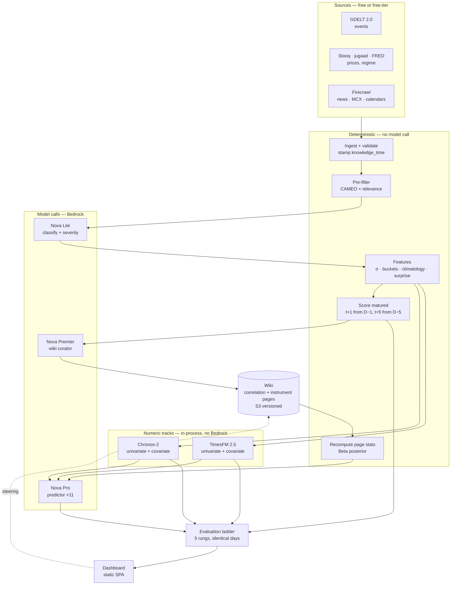

# FinEvents — System Design

**Status:** Design — authoritative. Precedes `Requirement.md`.
**Date:** 2026-08-09
**Governed by:** ADRs 0001–0040 ([index](adr/README.md))

This document describes how the whole machine works, end to end, so that requirements can be written against something concrete. It does not re-argue decisions — every choice below traces to an ADR, cited inline.

---

## 1. What the system does

Once a day, after the US close, FinEvents:

1. Collects prices, world events, scheduled economic releases and regime covariates
2. Scores yesterday's predictions against what actually happened
3. Writes what it learned into a wiki it maintains itself
4. Reads that wiki and predicts tomorrow — as a *departure* from a statistical baseline
5. Records everything so the learning curve is measurable

**The product is step 3 and 5.** Steps 1, 2 and 4 exist to make them meaningful.

### The one-sentence version

*Three independent forecasters compete on the same unseen day — two time-series foundation models and one agent that reads an accumulated wiki of event-to-price correlations — and the only question the system exists to answer is whether the third one beats the first two, and whether that gap grows.*

---

## 2. The system in one picture



**The dividing line is ADR-0004's:** ingest, filtering, feature computation, scoring and statistics are plain Python. Only classification, prediction and curation call a model. **Chronos and TimesFM sit on the deterministic side** — they are numeric libraries called by pipeline code, not agents (ADR-0030).

### 2.1 What is an agent, and what is not

This project is described as an agentic system, so the boundary needs stating precisely rather than being inferred from a diagram. There are three tiers, and the word "agent" applies to exactly one of them.

| Tier | Definition | Components |
|---|---|---|
| **1 — Deterministic** | No model involved at all | Ingest, validation, pre-filter, feature computation, scoring, page statistics, orchestration, publishing, **Chronos-2, TimesFM 2.5** |
| **2 — Model call** | Prompt assembled by code, one call, structured output. No tools, no loop, no choice about what to read | **Classifier** (Nova Lite), **Predictor ×11** (Nova Pro), **Curator** (Nova Premier) |
| **3 — Agent** | Has tools, runs its own loop, decides its own next step | **Empty.** |

**As designed today, nothing in this system is an agent.** "AgentCore" appears throughout as a *compute host* — it runs containers — which makes agents look present when only the hosting is. That distinction is easy to lose and worth being blunt about.

#### How the agency drained out

Five decisions, each individually sound, with an unrecorded cumulative effect:

| ADR | Decision | What the model stopped deciding |
|---|---|---|
| 0004 | Orchestration is Step Functions; LLM = judgment only | What to do next |
| 0021 | Deterministic pre-filter before classification | What to look at |
| 0025 | Manifest key lookup, no knowledge base | What to read |
| 0029 | One call per instrument, prompt pre-assembled | What context it needs |
| 0034 | Confidence computed in code | Any number at all |

#### Where tier 2 is the right answer

**The predictor must stay a single call, and this is not a cost argument.**

- An agent loop has nondeterministic call count and ordering, which breaks record-and-replay cassettes (ADR-0018) and makes daily spend unbounded
- An agent that chooses what to fetch can fetch past the cut-off. Deterministic assembly closes invariant **I4** by construction; an agent reopens it as a runtime property that must be tested for on every run
- Under forward-only (**I1**) a leaked prediction cannot be re-run. There is no second attempt at a live day

The predictor's task is one bounded judgment — *shift this distribution or don't*. Agency would add leakage surface and cost to buy nothing.

**The scrapers are correctly tier 1**, though the reason is non-obvious: Firecrawl's JSON-schema extraction is itself LLM-driven, so the resilience-to-page-redesign that a scraper agent would provide already exists — inside Firecrawl, not in our code. Wrapping our own loop around it would duplicate it.

#### The curator was the candidate, and it was examined and declined

The curator is the one component doing genuinely open-ended work, and four tools were proposed for it. Three collapsed under examination and the fourth failed on its own terms ([ADR-0041](adr/0041-no-agents-deterministic-pipeline.md)):

| Proposed tool | Verdict |
|---|---|
| `read_page(path)` | **Replaceable.** The link graph is in the manifest — pre-load 1-hop neighbours. Same information, no loop. |
| `list_pages(prefix)` | **Already available.** The manifest *is* the page index. |
| `flag_contradiction(...)` | **Not a tool.** A field in the structured output. |
| `query_history(...)` | **Doesn't fix its target risk.** A model that never thinks of a hypothesis will not query for it either — agent curiosity is bounded by the same imagination that produced the gap. |

**And non-determinism is worst precisely here.** ADR-0040 put the stronger model on the curator *because* its errors are unrecoverable under forward-only. Adding a loop that takes a different path on every re-run, to the one component whose mistakes compound permanently, is backwards — and it would make ADR-0018's cassettes hardest to maintain exactly where regression testing matters most.

#### What replaces the agency

Two deterministic additions, both cheaper and more complete than the tools they stand in for:

**Link-neighbour pre-loading** — when consolidating page P, the prompt carries P's 1-hop neighbours from the manifest's link graph, capped at N. This is what `read_page` was for: cross-page reasoning without a loop. Curator input grows ~20k → ~35k tokens, **+$1.15/month**, no extra calls.

**The correlation sweep** — a nightly Lambda, no model. It walks the entire (event category × instrument × horizon) grid, computes each cell's Beta posterior, and surfaces cells whose credible interval excludes 0.5 but which have **no wiki page**, or whose page contradicts the statistics. Those become *"grid cells worth a page"* in the curator's prompt.

This is what closes the hypothesis-space risk, and it closes it better than an agent would: it sweeps the whole grid every night rather than the corners a model finds interesting, and its output is reproducible from the data. The curator still judges whether a candidate is real or spurious. **Code finds; the model interprets** — the same division running through the entire system.

#### Consequences recorded

- **Strands SDK is removed from the tech stack.** It was a decided component with nothing to build.
- **AgentCore Runtime is kept, with its rationale amended.** ADR-0028 justified it largely on the 8-hour window sequential replay needed; forward-only deleted that. It stays for different reasons — warm weights for the two foundation models (~1.3GB, which Lambda would cold-start badly), per-second billing on active CPU only, and Observability's per-stage token metrics. Fargate is the alternative if hosting zero agents on AgentCore ever becomes a real problem.
- **The project description is corrected.** This is a deterministic pipeline with three single-shot model calls and a self-maintained knowledge wiki. The wiki is the product; agency was never load-bearing for it.

**Status: decided ([ADR-0041](adr/0041-no-agents-deterministic-pipeline.md)).** Tier 3 stays empty deliberately. Any future document calling this an agentic system is wrong until that ADR is superseded.

---

## 3. Six invariants

Everything below follows from these. A design that violates one is wrong regardless of how well it works.

| # | Invariant | ADR | Why |
|---|---|---|---|
| I1 | **The agent never runs against a past date.** History feeds calibration, the wiki seed and threshold tuning — never agent execution. | 0037 | Removes contamination and reconstruction leakage by construction rather than by mitigation |
| I2 | **Models do judgment only.** Every number that can be computed, is computed. | 0004, 0034 | Cost, determinism, and the fact that an LLM producing a hit rate is producing a hallucination with decimal places |
| I3 | **Prediction is a departure from a baseline**, never an absolute outcome and never a price. | 0029 | Makes skill measurable against a stated reference; a model that echoes the baseline scores zero honestly |
| I4 | **Nothing enters a prompt with a `knowledge_time` after the run's declared cut-off.** | 0016, 0037 | The single live leakage discipline once reconstruction is gone |
| I5 | **Every wiki observation carries provenance** — `seeded` or `observed`. | 0038 | Otherwise "the agent learned this" and "arithmetic already knew this" are indistinguishable |
| I6 | **The run manifest is written last.** | 0026 | Makes a run atomic — a crash leaves the previous manifest valid rather than a half-written wiki |

---

## 4. The daily run

One Step Functions execution, fired by EventBridge after the US close, trading-day aware (ADR-0004).

| # | Step | Runs on | Model | Writes |
|---|---|---|---|---|
| 1 | Declare cut-off timestamp | Lambda | — | run record |
| 2 | Fetch prices — Stooq, jugaad-data, MCX | Lambda | — | `raw/` |
| 3 | Fetch events — GDELT 2.0 | Lambda | — | `raw/` |
| 4 | Fetch calendar consensus + actuals, news | Lambda (Firecrawl) | — | `raw/` |
| 5 | Fetch regime covariates — FRED | Lambda | — | `raw/` |
| 6 | Validate, stamp `knowledge_time`, bitemporal write | Lambda | — | price / event / macro stores |
| 7 | Deterministic pre-filter over GDELT | Lambda | — | candidate events |
| 8 | Classify + score severity | AgentCore | **Nova Lite** | event records, overlay-versioned |
| 9 | Compute σ, bucket boundaries, conditional climatology, standardised surprise | Lambda | — | feature store |
| 10 | **Score matured predictions** — t+1 from D−1, t+5 from D−5 | Lambda | — | scores, all tracks |
| 11 | **Consolidate the wiki** — prompt carries the affected pages, their **1-hop link neighbours**, and yesterday's sweep candidates (ADR-0041) | AgentCore | **Nova Premier** | wiki pages, `observed` |
| 12 | Recompute page statistics — Beta posterior, three ways | Lambda | — | wiki pages |
| 12a | **Correlation sweep** — full event × instrument × horizon grid; surface cells with no page, or whose page contradicts the data (ADR-0041) | Lambda | — | candidate list for tomorrow |
| 12b | **Refit calibration map** + recompute the predictor's own track record (ADR-0042) | Lambda | — | calibration map, block 6b payload |
| 13 | Chronos-2 forecasts — 11 × 2 configs | AgentCore, in-process | — | track A |
| 14 | TimesFM 2.5 forecasts — 11 × 2 configs | AgentCore, in-process | — | track B |
| 15 | Assemble 11 prompts, snapshot each | AgentCore | — | prompt snapshots |
| 16 | **Predict** — one call per instrument | AgentCore | **Nova Pro** | track C raw, **and calibrated as a separate track** (ADR-0042) |
| 17 | Baseline-blind control, sampled days | AgentCore | **Nova Pro** | control predictions |
| 18 | Shadow predictor — evaluation window only | AgentCore | **Nova Premier** | shadow, never written back |
| 19 | **Write run manifest** | Lambda | — | manifest |
| 20 | Publish dashboard data | Lambda | — | DynamoDB, S3 |

### Why scoring and consolidation come *before* prediction

This ordering is load-bearing and easy to get backwards.

At D's close, the prediction made on D−1 for t+1 has matured. **The agent should know yesterday's outcome before predicting today** — that is the knowledge-accretion loop actually working rather than being one day stale. So the run scores, learns, recomputes statistics, and only then reads the wiki to predict.

The consequence: **steps 10–12 and step 16 must not be reordered or parallelised.** Step 16 reads what step 12 wrote.

### Where the money goes

| Step | Calls/day | Monthly |
|---|---|---|
| 8 — classify | 1 | $0.05 |
| 11 — consolidate | 1 | $4.25 |
| 16 — predict | 11 | $3.77 |
| 17 — control | sampled | $0.38 |
| 13–14 — Chronos + TimesFM | 44 forecasts | $0.05 |

**One call a day costs more than eleven.** That inversion is ADR-0040 — see §7.

---

## 5. The three tracks

All three predict the same thing: a probability distribution over five volatility-relative movement buckets, at t+1 and t+5, for each of 11 instruments (ADR-0008, 0032).

Buckets are expressed in standard deviations over the trailing 60 sessions, so "large up" means the same thing for gold and for NIFTY.

### Track A — Chronos-2

Amazon's time-series foundation model. 120M parameters, encoder architecture, discrete tokenisation. Runs **in-process from Hugging Face weights** inside AgentCore — not on Bedrock, not on a SageMaker endpoint (which would cost ~$75/month standing to serve 44 forecasts a day).

**What it receives** — a fixed-length rolling window, never the full archive:

```
context    = [close[t−N], … , close[t]]        # N ≈ 512–1024 sessions
covariates = severity[], is_festival[], dxy[], real_yield[], vix[], wti[]
             # aligned time series over the same window, not scalars
output     = quantiles at t+1 … t+5  →  converted to bucket probabilities
```

**Covariates are series, not values.** Event severity is not "today is 2.1" — it is a series across the whole window, zero on most days with occasional spikes. That is what lets Chronos learn the *shape* of a post-event reaction statistically, which is what makes it a fair rival to the agent's semantic reasoning rather than a strawman.

**Two configurations run:** univariate (price only) and covariate-informed. The univariate one is shown to the agent; the covariate-informed one is a scoring rival the agent never sees.

### Track B — TimesFM 2.5

Google's equivalent. 200M parameters, decoder architecture, 16K context, continuous patches. Same two configurations, same conversion to buckets.

**Kept deliberately separate from Chronos — no ensembling** (ADR-0032). Where the two disagree is itself signal: it marks the series-dynamics view as uncertain, which is precisely when event context is most likely to matter. An ensemble would average that signal away.

### Track C — the agent

Nova Pro, one call per instrument, reading a seven-block prompt.

| Block | Content | Changes |
|---|---|---|
| 1 | Task frame — bucket definitions, output schema, abstention rules | Stable |
| 2 | Instrument page from the wiki | Slowly |
| 3 | **Both** univariate forecasts, separately labelled — Chronos and TimesFM as bucket probabilities | Daily |
| 4 | Regime state — five covariates as σ-relative moves, **identical across all 11 calls** | Daily |
| 5 | Today's events — category, severity, actors, geography; scheduled releases with standardised surprise | Daily |
| 6 | Accumulated evidence — correlation pages with counts, hit rates, computed confidence, disconfirming cases, each tagged `seeded` / `observed` | Slowly |
| **6b** | **Your own track record** (ADR-0042) — reliability by confidence band, directional balance, departure discipline, RPS by severity. All computed, none model-written | Daily |
| 7 | Output instruction | Stable |

**Coherence without a shared call.** Eleven separate calls could produce mutually contradictory forecasts. Block 4 is byte-identical across all eleven, so the instruments reason from one view of market state without a twelfth "market state" call. A post-hoc coherence metric checks structural relationships — NIFTY versus SENSEX is the sharpest tripwire, since they should almost never diverge.

### What the agent is actually being asked

Not *"what will gold do tomorrow?"* — which it would answer badly. It is asked:

> The conditional climatology baseline for gold on this calendar date in this regime is distribution B. Chronos says B′, TimesFM says B″. Event E occurred at severity S. Accumulated evidence for (E × gold) says H, over N observations, with computed confidence C. **How should the distribution shift — and if the evidence does not support a shift, say so.**

That framing is why a mid-tier model is viable here (§7), and why the anchoring index (below) is the metric that matters most.

---

## 6. The wiki

The knowledge layer, modelled on Karpathy's LLM Wiki pattern (ADR-0005): the agent's memory grows and is reused day over day rather than rebuilt each run.

### Page types

| Type | Key | Example |
|---|---|---|
| Correlation page | event category × instrument | `correlations/central-bank-surprise__gold-spot-usd.md` |
| Instrument page | instrument | `instruments/gold-spot-usd.md` |
| Regime page | covariate condition | `regimes/real-yields-rising.md` |

**Page selection is a deterministic key lookup, not a search** (ADR-0025). No managed knowledge base, no vector store — a KB cannot be queried as-of a past date, which would have broken evaluation, and at this scale a manifest index is both cheaper and auditable.

### Anatomy of a correlation page

```markdown
# Central bank surprise → gold spot (USD/oz)

## Hypothesis
A hawkish surprise — policy rate above consensus — is followed by gold
weakness at t+1, decaying substantially by t+5.

## Evidence
| Date       | Direction | Severity | Predicted | Actual | Hit | Source   |
|------------|-----------|----------|-----------|--------|-----|----------|
| 2019-06-19 | hawkish   | 2.1      | —         | −1.4σ  | —   | seeded   |
| 2022-09-21 | hawkish   | 2.8      | —         | −2.1σ  | —   | seeded   |
| 2026-09-17 | hawkish   | 1.8      | down      | −0.9σ  | yes | observed |
| 2026-10-02 | hawkish   | 2.0      | down      | +1.2σ  | no  | observed |

## Computed — never model-written
- seeded:   31 obs · 61% hit · 90% CI [0.44, 0.76]
- observed:  4 obs · 75% hit · 90% CI [0.36, 0.96]
- combined: 35 obs · 63% hit · 90% CI [0.47, 0.76]

## Contradictions
- 2026-10-02 — hawkish surprise, gold rose 1.2σ. Coincided with a
  geopolitical escalation. See [[geopolitical-conflict__gold-spot-usd]].

## Links
[[central-bank-surprise__nifty-50]] · [[regimes/real-yields-rising]]
```

Three things about this page are the whole design:

**The `Computed` block is written by code, not by the model** (ADR-0034). Confidence is a Beta-Binomial posterior over the evidence list. This is why recency cannot swing confidence wildly — the posterior bounds it mathematically, with no clamp parameter to tune.

**Three figures, not one** (ADR-0038). `seeded` comes from a deterministic join over pre-go-live history; `observed` is the system's own scored record. The learning curve plots `observed` only, so it starts at zero on day 1 regardless of seeding.

**Contradictions are mandatory, not optional.** A page that only records confirmations is how asset-linkage priors become self-fulfilling.

### How the wiki is written

Step 11, one Nova Premier call per day. It receives the day's scored outcomes and the affected pages, and it decides:

- What the outcome means for the stated hypothesis
- Whether it contradicts the page and should be flagged
- Whether the hypothesis should be revised

It does **not** decide which page to write to (key lookup), what the hit rate is (computed), or what the confidence is (computed). Its output is prose and structure — which is precisely the part that cannot be computed.

### Versioning

S3 object versioning plus a per-run manifest (ADR-0026). The manifest records the exact `version_id` of every page as of that run, and it is **written last**, which is what makes a run atomic. A crash mid-consolidation leaves the previous manifest — and therefore the previous coherent wiki state — intact.

Every prediction cites pages by `path@version_id`, so any forecast can be replayed against exactly the knowledge that produced it.

---

## 7. The models

| Role | Model | Calls/day | Parameter |
|---|---|---|---|
| Classification, severity | Nova Lite | 1 | `/finevents/{env}/model/classify` |
| Prediction | Nova Pro | 11 | `/finevents/{env}/model/reason/predict` |
| Wiki curation | Nova Premier | 1 | `/finevents/{env}/model/reason/curate` |

No model ID appears in application code (ADR-0027). All three are SSM parameters, asserted at deploy.

### Why the split (ADR-0040)

**The predictor is heavily scaffolded.** It receives two foundation-model forecasts, computed regime state, computed severity, and computed confidence. It emits no number that is not a bucket probability. Its task reduces to *shift this distribution or don't* — and a weak model there **fails safe**, leaning on the baselines so the system degrades to "as good as Chronos and TimesFM." That is a high floor.

**The curator has none of that scaffolding**, and forward-only made its errors permanent:

| | A bad prediction on day 40 | A bad wiki page on day 40 |
|---|---|---|
| Under replay | Re-run for $24 | Re-run for $24 |
| **Under forward-only** | Scored, then forgotten. One of ~5,500. | **Compounds.** Repairing means re-consolidating days 41→N, and forward-only removed that machinery. |

The stronger model goes where both asymmetries point. It costs $3/month more than putting Pro everywhere, and $8.64/month less than putting Premier everywhere.

### Why not something stronger everywhere

Nova Pro scores 8 on the Artificial Analysis Intelligence Index against Premier's 13, and is not a reasoning model in the extended-chain-of-thought sense. That gap is real but may not bind on a task this scaffolded — which is an empirical question, so it gets an experiment rather than an argument: **Nova Premier shadows the Pro predictor for 60 days on 4 instruments, ~$18** (ADR-0039). Scored on RPS *and* anchoring index, because two models with equal RPS but different anchoring are not equally good.

The shadow is recorded and scored. **It never reaches the wiki, the dashboard, or any consolidation call** — an observer with no side effects.

---

## 8. Evaluation

The point of the system. ADR-0033 makes the harness a first-class deliverable, not test tooling.

### The ladder

Five rungs, all scored on **identical live days** against the same unseen targets:

| Rung | What it is | What beating it proves |
|---|---|---|
| 1 | Climatology | Better than the unconditional base rate |
| 2 | Conditional climatology | Better than calendar and regime alone — the confounding check |
| 3 | Chronos-2 | Better than a state-of-the-art series model |
| 4 | TimesFM 2.5 | Not a quirk of one foundation model |
| 5 | **Agent — raw** | Event reasoning adds something the series cannot see |
| 6 | **Agent — calibrated** (ADR-0042) | Nothing on its own. **The 5 → 6 gap measures how miscalibrated the model is** |

Rung 2 is the one that matters most for honesty. If Diwali and a rate-hike regime explain the movement, the event narrative is decoration.

**Rung 6 is never presented as the agent's skill.** It is the agent plus a fitted post-processor. Conflating them would overstate what the reasoning contributed.

### How the system actually improves

Two arms, both computed, both read back the next day. Neither requires an agent.

**Arm 1 — knowledge about the world.** The wiki loop:

| Day | What happens |
|---|---|
| D | Score: gold, hawkish surprise, predicted small-down 0.41, actual −0.7σ. Hit. |
| D | Curator appends the observation and states what it means for the hypothesis |
| D | Code recomputes: 34 → 35 observations, hit rate 63% → 64%, credible interval tightens |
| D+1 | The predictor reads that page — a different number, a narrower interval than yesterday |

Four things drive it: the evidence base grows, the posterior tightens, the curator can **rewrite the hypothesis** when it stops holding, and the nightly sweep (ADR-0041) surfaces cells where the data disagrees with what a page claims.

**Arm 2 — knowledge about the predictor.** Arm 1 has a blind spot, and it is the important one:

| Failure | Does the wiki catch it? |
|---|---|
| *"Rate surprises don't move gold the way this page claims"* | **Yes** — hit rate falls, the curator revises |
| *"The model says 0.70 and that bucket occurs 45% of the time"* | **No** — overconfidence is spread across every page; no page's hit rate reveals it |
| *"The model over-departs from the baseline on high-severity days"* | **No** — same reason |

Systematic errors are properties of the predictor, not of any correlation, and they are the most fixable kind. ADR-0042 closes the gap two ways:

- **Prompt block 6b — the predictor's own track record**, computed nightly: reliability by confidence band, directional balance, departure discipline, RPS by severity. Arithmetic only, for the same reason scoring is arithmetic only — a self-assessment the model wrote is one the model could flatter.
- **A nightly-refit calibration map** (isotonic, pooled across instruments, split by horizon) applied mechanically, so the correction does not depend on the model choosing to act on what it read.

**The 5 → 6 gap should shrink over time.** If it does, the model is learning from its own record. If it stays flat, it is not — and the mechanical layer is carrying it. Either way the number tells you which, which is why both tracks are kept rather than one.

### Metric

**Ranked Probability Score** — the correct metric for ordinal buckets. Predicting "small up" when the outcome is "large up" is a smaller error than predicting "large down," and RPS is the scoring rule that knows that.

### Why scoring has no model in it

Scoring (step 10) and consolidation (step 11) look adjacent — both happen after an outcome is known — and it is natural to assume the first needs judgment. It does not, and it must not.

**The two steps are deliberately separated:**

| | Step 10 — scoring | Step 11 — consolidation |
|---|---|---|
| Question | **What happened?** | **What does it mean?** |
| Input | Stored prediction, stored bucket boundaries, today's close | The score, the affected pages, their neighbours |
| Method | Arithmetic | Judgment |
| Runs on | Lambda | Nova Premier |
| Reproducible | Exactly, forever | No — and that is fine |

Every input to scoring was fixed at prediction time. Bucket boundaries were computed from the trailing-60 σ and **stored with the prediction**, so scoring never recomputes them. The realised move is a subtraction and a division. Mapping it to a bucket is a comparison against stored thresholds. Ranked Probability Score is a formula.

**There is nothing to decide.** Which is the point:

- **A model that scores can grade its own homework.** The project's stated success criterion is that a *null* result is believable (`Product.md`). A model anywhere in the scoring path destroys that claim, and no amount of prompting restores it.
- **The too-good-to-be-true trip depends on it.** Skill above a ceiling fails the build because a strong result is more likely a bug than a discovery. That inference only holds if the scorer is incapable of being generous — otherwise a suspicious result has three explanations instead of two.
- **Scores must be reproducible forever.** The learning curve compares day 400 against day 40. If the scorer drifts, the curve measures the scorer.

### Edge cases that look like judgment, and their deterministic rules

| Case | Rule |
|---|---|
| Market closed on the target day | Horizons count **trading days**, not calendar days, from the market calendar. A t+1 over a holiday matures on the next session. |
| Scrape failed; no close available | Hard failure. Retry, then alert. **Never** a judged substitute value. |
| The agent abstained | Not a miss. Coverage and missed-moves are tracked separately (ADR-0013), by counting, not by judging. |
| Contract roll or corporate action | Adjusted series from source, with explicit roll dates in the instrument config. Discontinuities are handled at ingest, never at scoring. |
| The close is later revised | The score computed at maturity **stands**, with its data vintage recorded. A revision that changes the bucket is written as a **second, separate scored record** — never an overwrite. Both appear in the audit trail; the original is what counts toward the skill record. |
| *"Why was it wrong?"* | **Not a scoring question.** That is step 11, and it is a model call. |

That last row is the whole answer. Judgment about an outcome exists in this system — it is just downstream of the number, not inside it. Keeping the scorer dumb and the interpreter smart is what makes the record worth interpreting.

### Controls

| Control | Detects |
|---|---|
| **Anchoring index** — same prediction with and without the baselines shown | The model echoing what it was handed and calling it skill |
| **Seeded/observed divergence** | The agent reproducing the seed rather than learning from its own record |
| **Coherence violations** | Structurally impossible cross-instrument forecasts from independent calls |
| **Abstention coverage + missed moves** | The system buying accuracy by declining the hard days |
| **Shuffle test** | Skill that survives destroying the event–date relationship, i.e. reading the price series instead of the events |
| **Too-good-to-be-true trip** | Skill above a ceiling **fails the build.** A strong result here is more likely a bug than a discovery. |

### What the dashboard shows

- The learning curve: agent RPS minus best-baseline RPS, over elapsed days, on `observed` evidence only
- All five rungs, per instrument and horizon
- Per-prediction audit: the exact prompt snapshot, cited pages at their `version_id`, the reasoning, the outcome
- Coverage and abstention
- **Two skill series, always shown together** — agent-authored pages versus human-touched pages (ADR-0043). Reporting only the aggregate reintroduces the confound the provenance model exists to prevent, so the split is asserted in CI.
- **The tuning-window boundary** (ADR-0045), with every reported figure naming the periods it covers

### Steering (ADR-0043)

Four verbs, Cognito-authenticated, fully audited:

| Verb | Effect |
|---|---|
| **Flag** | Marks a page or evidence row suspect. Enters the curator's next prompt as *"a human disputes this."* Changes no content. |
| **Propose** | Submits a hypothesis into the correlation sweep's candidate queue. The curator must address it — accept, reject with reasoning, or open a page. |
| **Edit** | Writes directly to a page's hypothesis or narrative. Versioned; marks the page's authorship. |
| **Correct** | Fixes source data — a misclassified event's category or severity. Triggers a rescore written as a *separate* record, never an overwrite. |

**Provenance is finer-grained than a third tag.** A human does not generate observations — writing evidence rows would be fabricating data. So:

- **Evidence rows** stay `seeded` or `observed`, never `human`. A corrected row keeps its source tag and gains a `corrected_by` audit field.
- **Page hypothesis and narrative** carry `author: agent | human | mixed`.
- **Sweep candidates** carry `origin: sweep | human`.

The learning curve is unchanged — still `observed` rows only. What changes is that skill must be reported separately for agent-authored and human-touched pages, because *a correct prediction citing a human-written hypothesis is not the agent having learned anything.*

**The audit trail is published** (ADR-0044), which is what makes steering self-policing. The failure worth fearing is not a human helping — it is a human quietly steering toward a favourable result and reporting it as the agent's. A public audit makes that impossible to do silently, which is a stronger guarantee than restricting the interface would have been.

### Measurement periods (ADR-0045)

The first **60 trading days** are a tuning window. Predictions are made, scored, and **published labelled `tuning`** — but excluded from headline skill and from the learning-curve trend. The wiki learns throughout; only the claim is suspended.

The boundary is not an arbitrary duration. It is *the last day on which the configuration could still change* — the shadow A/B (ADR-0039) concludes at day 60, and until it does the reasoning model may still be replaced. That makes the cut-off decidable before go-live and unaffected by any result.

**No extension.** Incomplete calibration at day 60 is a finding, not grounds for moving the line.

Any later configuration change — model, prompt, filter or overlay version — **begins a new measurement period**, versioned and reported separately. The skill record is a sequence of configuration-stamped periods with visible seams, not one continuous line. A system that changed is not the same system.

---

## 9. Data model

### Bitemporal, everywhere

Every record carries `event_time` (when it happened) and `knowledge_time` (the earliest we could have known it). Revisions **append**; nothing is updated in place.

Under forward-only this is no longer used to reconstruct the past — it is what makes **scoring** correct. A t+5 prediction matures five days later and must be scored against what was known at t.

`knowledge_time` cannot be retrofitted onto populated stores, which is why the schema is built first.

### Stores

| Store | Holds |
|---|---|
| S3 `raw/` | Every fetched payload, unmodified, fetch-stamped |
| S3 `wiki/` | Pages + run manifests, versioning on, deletion protection in Prod |
| S3 Parquet | Price and covariate history for range scans |
| S3 `cassettes/` | Recorded model responses (ADR-0018) |
| DynamoDB | Predictions across all tracks, scores, run state, steering actions |
| Athena | Range scans over Parquet |

---

## 10. A worked day

**Friday 2026-11-13, 21:05 UTC.** The run fires.

1. Cut-off declared: `2026-11-13T21:00:00Z`. Nothing with a later `knowledge_time` may enter any prompt today.
2. Ingest pulls the day's closes, 4,100 GDELT records, the Fed's actual decision against Wednesday's scraped consensus, and FRED covariates.
3. Pre-filter reduces 4,100 GDELT records to 6 candidates.
4. Nova Lite classifies: one CAMEO 173 (coercion, Middle East, severity 2.4), one central-bank surprise (+25bp vs consensus, standardised surprise +1.8σ), four below threshold.
5. Features: gold's trailing-60 σ is 0.94%, so bucket boundaries follow; conditional climatology for a November Friday in a rising-real-yield regime is computed.
6. **Scoring.** Thursday's t+1 prediction for gold said "small down, 0.41". Gold closed −0.7σ — small down. Hit. Monday's t+5 prediction for NIFTY said "flat, 0.38". NIFTY moved +1.9σ. Miss.
7. **Consolidation.** Nova Premier reads both outcomes. On `central-bank-surprise__gold-spot-usd` it appends the observation and notes the hypothesis held. On `geopolitical-conflict__nifty-50` it appends a miss and **flags a contradiction** — the page claims escalation drives Indian equities down; they rose.
8. Statistics recompute. The gold page's `observed` arm moves to 5 obs, 80% hit, CI [0.42, 0.97]. Still too wide to act on. That is the design telling the truth.
9. Chronos and TimesFM forecast all 11 instruments. On gold they disagree — Chronos says mild down, TimesFM says flat. Disagreement is itself signal.
10. **Prediction.** The gold prompt carries: both baselines, the regime block, today's two events, and the gold correlation pages with all three confidence figures. Nova Pro shifts the distribution down modestly and cites `central-bank-surprise__gold-spot-usd.md@v7f3a`, reasoning that the surprise is real but the geopolitical event historically pushes the other way.
11. Control and shadow run. Manifest written. Dashboard published.

**Total elapsed: minutes. Total cost: about $0.26.**

---

## 11. Failure modes and what catches them

| Failure | Caught by |
|---|---|
| A future-dated record reaches a prompt | Snapshot integrity test — every value's `knowledge_time` ≤ cut-off, no exceptions list |
| **US close used to predict an already-closed Indian session (L9)** | **Cross-market ordering test in UTC instants**, table-driven over asymmetric holidays and DST. The top leakage risk. |
| Agent echoes the baseline and looks skilful | Anchoring index; baseline-blind control on the same model |
| Overlay change silently rewrites event history | Version stamped per event; changes trigger a rescore, not an in-place edit |
| Bad classification poisons the wiki seed | Spot-check against a stronger model **before** the seed is built |
| Crash mid-consolidation leaves a half-written wiki | Manifest written last; previous manifest stays valid |
| A confidence figure conflates seeded and observed | Tag-awareness asserted in CI, not left to review |
| A backtest number gets quoted as skill | There is no agent backtest. Numeric calibration is labelled everywhere it surfaces. |

---

## 12. Explicitly not in v1

- Individual equities — indices and metals only (ADR-0009)
- Ensembling the three tracks (ADR-0032)
- Multivariate Chronos — deliberately handicapped to match the agent's per-instrument shape, so a loss is attributable
- Runtime model escalation by severity (ADR-0027)
- Any claim about tradeable alpha, profitability, or investment advice (`Product.md`)

---

## 13. What is still open

**All substantive design decisions are recorded.** What remains is six thresholds — none a design question, each a number to fit against data that does not exist yet. `Requirement.md` specifies the method for each; values are set during build.

| Open | Calibrated against |
|---|---|
| Correlation sweep ranking rule (ADR-0041) | Seed join. Too loose floods the curator, too tight surfaces nothing |
| Pre-filter recall floor, labelled-sample size (ADR-0021) | Hand-labelled GDELT sample |
| Classification spot-check disagreement (ADR-0022) | Stronger model on the labelled sample — **gates the seed** |
| Severity threshold for mandatory prediction (ADR-0013) | Seed join: severity vs realised σ move |
| Calibration minimum-sample gate (ADR-0042) | Scored record; below the gate rung 6 equals rung 5 |
| Baseline-blind control sampling rate (ADR-0029) | Cost against anchoring-index precision |

One scheduling choice remains and blocks nothing: whether to run the `seed_enabled` ablation (ADR-0038) at go-live or later. The flag and provenance tags are required either way.

Nine pre-build verification items are listed in [aws-architecture.md](design/aws-architecture.md), plus four data-terms checks in [ADR-0044](adr/0044-licence-and-publication-policy.md) that must clear **before** the repository goes public.
