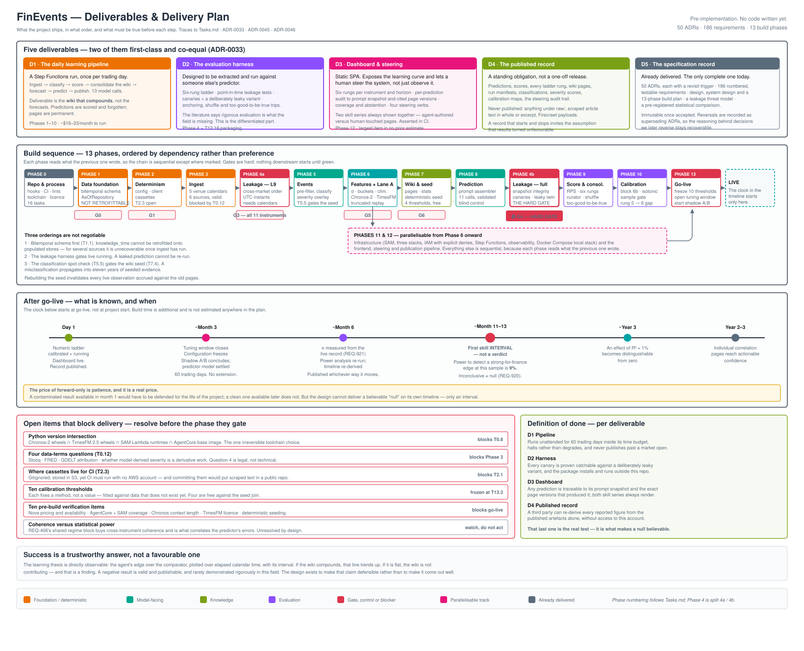

# FinEvents — Tasks

**Status:** Baseline v1
**Date:** 2026-08-09
**Traces from:** [Requirement.md](Requirement.md) via [Design.md](Design.md)



*[project-deliverables-diagram.svg](design/project-deliverables-diagram.svg) — the five deliverables, the phase sequence with its gates, the post-go-live milestone timeline, what currently blocks what, and the definition of done for each deliverable.*

Ordered by dependency, not by preference. Three orderings are **not negotiable**:

1. **Bitemporal schema first (T1.1).** `knowledge_time` cannot be retrofitted onto populated stores — for several sources the information needed to reconstruct it is unrecoverable once ingest has run without it.
2. **The leakage harness gates live running (Phase 4).** Under forward-only a leaked prediction cannot be re-run. There is no second attempt at a live day.
3. **The classification spot-check gates the wiki seed (T5.5 → T7.4).** A misclassification propagates into eleven years of seeded evidence, and rebuilding invalidates any live record accrued against the old pages.

**Gate** means: nothing downstream starts until it is green.

---

## Phase 0 — Repository and process

| # | Task | REQ | Notes |
|---|---|---|---|
| T0.1 | `git init`; set `user.email` to `itamittech@gmail.com` and verify before the first commit | REQ-005 | The brief calls this out specifically |
| T0.2 | Apache 2.0 `LICENSE` + `NOTICE` | REQ-1105 | |
| T0.3 | `DATA_SOURCES.md` with per-source licence and attribution | REQ-1109, REQ-1110 | |
| T0.4 | Pre-commit hook: credential and environment-file scan (gitleaks/detect-secrets + pattern rule) | REQ-1101 | |
| T0.5 | Pre-commit hook: block `raw/` paths and scraped-payload signatures | REQ-1102 | Silent failure, permanent once public. **Define the payload signature in Design first** — it is referenced four times and defined nowhere |
| T0.6 | **CI-on-PR documentation-currency check** with a config-driven source-path→doc mapping, plus the `docs: n/a — <reason>` escape hatch | REQ-1103, REQ-1116 | **Not a post-commit hook** — ADR-0014 rejected that outright, since it fires after the commit exists and can only warn |
| T0.6a | Pre-commit: bandit SAST and pip-audit CVE gates | REQ-1113, REQ-1114 | Both decided in ADR-0014 and previously carried by no REQ and no task |
| T0.6b | CI-on-PR: pull request must reference a REQ-id or ADR | REQ-1115 | ADR-0001's traceability chain, enforced |
| T0.7 | CI running the same validation as the hooks, **and verifying the hooks ran** | REQ-1104 | Hooks are convenience and bypassable; CI is the gate |
| T0.8 | Python scaffold with the Design §1 module layout | — | |
| T0.9 | Import-boundary lint: no storage client outside `ingest/`+`repository/`; no model client outside `events/`+`predict/`+`wiki/` | REQ-104, REQ-1005 | ADR-0004's line as a lint |
| T0.9a | **Forward-only lint** — no call site outside `harness/` and the Lane A calibration path constructs an `AsOfRepository` with an `as_of` earlier than today; no replay entry point exists at any scope | REQ-601 | Same AST walk and module graph as T0.9, so write it in the same pass. **This is the only mechanical enforcement of ADR-0037**, the project's largest decision — until it exists, forward-only is aspirational rather than asserted |
| T0.10 | Traceability check, three assertions: every **Accepted** ADR referenced by ≥1 REQ; every REQ carrying a verification code; **every REQ reachable from a task** | REQ-006 | The third fails today on the REQs listed under "Requirement coverage gaps" below. Fix the requirements, never weaken the check. "Accepted" scopes out superseded ADRs like 0006 |
| T0.11 | **Clear the ten pre-build verification items** in [`aws-architecture.md`](design/aws-architecture.md) § "Verification needed before build" | — | Do not restate the list here; it drifts. Includes whether Bedrock Batch Inference supports prompt caching, which underwrites both the backfill line and the caching credit |
| T0.12 | **Clear the three data-terms questions**, asserted in CI as a precondition on Phase 3 and on T12.16 | REQ-1111 | ADR-0050 rebinds the gate: it blocks **data**, not repository visibility. An open question in `DATA_SOURCES.md` blocks the fetcher for that source |
| T0.13 | ✅ **Choose the toolchain**: Python version, packaging/lockfile, test runner, AWS mocking, CI platform | — | **Done 2026-08-10 — [ADR-0054](adr/0054-toolchain.md).** Python 3.13, uv, pytest, moto, GitHub Actions. The intersection was measured rather than assumed and **does not bind**: 3.12, 3.13 and 3.14 all resolve to an identical pin set on `aarch64-manylinux_2_28`, because both forecasting packages ship pure-Python wheels and `torch` 2.13 covers `cp310`–`cp314`. 3.13 wins on exposure, not capability |
| T0.14 | *(settled by [ADR-0050](adr/0050-publication-gate-scoped-to-data.md) — the repo stays public; the gate moved to T0.12)* | — | |
| T0.15 | `Contributing.md` — including `pre-commit install` as a required setup step | REQ-1117 | ADR-0014 names this consequence explicitly; the hooks do nothing uninstalled |
| T0.16 | ✅ Define the **scraped-payload signature** in Design §9 | REQ-1102 | **Already done** — [Design §9](Design.md) defines every rule and both carve-outs. T0.5 implements it in `tools/check_payload_signature.py`, and `tests/tools/test_payload_signature.py` tests each rule for firing *and* each carve-out for not firing |

**Gate G0:** T0.4–T0.7 (incl. T0.6a, T0.6b), T0.9 and T0.9a green.

---

## Phase 1 — Data foundation

| # | Task | REQ | Notes |
|---|---|---|---|
| T1.1 | ✅ Bitemporal schema across all stores; `knowledge_time` derivation documented per source | REQ-101, REQ-103 | **Not retrofittable. Do this first.** Done — `finevents/repository/records.py`; derivation per source in [knowledge-time-derivation.md](design/knowledge-time-derivation.md), with the conservative fallback stated |
| T1.2 | ✅ Append-only write path; no in-place updates | REQ-102 | Done — the put carries `attribute_not_exists` on both keys, so an overwrite raises instead of succeeding quietly. `append_all` deliberately avoids `batch_writer`, which cannot carry the condition |
| T1.3 | ✅ `AsOfRepository` implementing the Design §2 protocol | REQ-104 | Done. Methods whose store arrives later raise `StoreNotYetAvailable` naming the increment, rather than returning empty |
| T1.4 | ✅ Property tests: no record past `as_of`; monotonicity; empty-history; explicit boundary equality | REQ-105–108, REQ-407 | Boundary equality is the likeliest bug and the least likely to be noticed — pinned at fixed instants in `test_boundary_equality.py` **and** generated in `test_asof_properties.py` |
| T1.5 | ✅ Frozen clock for Lane A mode — wall-clock access raises | REQ-109 | Done twice over: `repository/clock.py` provides the abstraction, and `check_boundaries.py` forbids `datetime.now()`/`date.today()`/`time.time()` anywhere under `src/finevents/` except that one file. The runtime half alone is defeated by a single import |
| T1.6 | ◐ DynamoDB tables and S3 prefixes per Design §3; versioning and Prod deletion protection | REQ-111–113 | **Declared and validated, not deployed.** Seven tables and the versioned bucket are in `template.yaml`; `DeletionPolicy: Retain` is set on **all** environments, not just prod, because `sam delete` on the wrong stack is a two-word mistake |

**Gate G1:** T1.4 green, T0.9 passing against real modules.

---

## Phase 2 — Determinism

| # | Task | REQ | Notes |
|---|---|---|---|
| T2.0 | `config/` + `ModelClient` with per-role SSM resolution (`CLASSIFY`/`PREDICT`/`CURATE`) | REQ-1007 | **Moved up from T8.2.** T2.1's cache key includes the model ID and T5.4 invokes `CLASSIFY` in Phase 5 — both precede Phase 8, so resolution cannot live there |
| T2.1 | Cassette record/replay layer; cache key includes model ID | REQ-1210, REQ-1211 | |
| T2.2 | Replay-mode cache miss is a hard failure, never a live call | REQ-1210 | A silent fallthrough reintroduces nondeterminism exactly where the test believes it removed it |
| T2.3 | **Decide where cassettes live for CI.** They are gitignored, stored in S3, and CI must run with no AWS account — and committing them would put scraped article text into a public repo | REQ-1210, REQ-1107 | Unresolved collision between ADR-0018 and ADR-0044. Blocks T2.1 |

---

## Phase 3 — Ingest

| # | Task | REQ | Notes |
|---|---|---|---|
| T3.1 | Market calendars as **UTC instants** for **NSE, BSE, NASDAQ, NYSE, MCX** (both sessions) + the ADR-0049 synthetic convention for OTC spot metals | REQ-211 | Input to the L9 test. Five venues, not two. MCX evening close overlaps the US session — the asymmetric case REQ-1204 must cover. Missing entry = hard CI failure |
| T3.2 | Festival/holiday table with 12-month forward coverage asserted | REQ-210 | |
| T3.3 | FRED index fetcher — `SP500`, `NASDAQ100`, `DJIA` | REQ-204 | Replaces the Stooq fetcher (ADR-0053). Free tier gives ~10y for SP500/DJIA — short of GDELT's Feb-2015 start, so the seed for those two begins 2016 |
| T3.4 | jugaad-data NSE fetcher | REQ-204 | |
| T3.5 | FRED covariate fetcher — **five** series: `DGS10`, `DFII10`, `DTWEXBGS`, `VIXCLS`, `DCOILWTICO` | REQ-205 | ADR-0017 is authoritative. Several documents previously enumerated only four while their counts said five |
| T3.6 | GDELT 2.0 event fetcher | REQ-206 | |
| T3.7 | Firecrawl fetchers — SENSEX, spot metals, MCX, economic calendars, news | REQ-207 | JSON-schema extraction |
| T3.13 | **Decide the metals currency convention.** REQ-201 says gold spot USD/oz; the available free daily history (Bank of Russia) is RUB/gram | REQ-201, REQ-204 | Converting via CBR's own USD/RUB carries **1.09% error against a 1.14% daily signal** — bucket assignment at ±0.5σ would be near-random. Either adopt local-currency series and say so, or find a native-USD daily source (Alpha Vantage `GOLD_SILVER_HISTORY`, free key, untested). **Not blocking now; blocks metals ingest.** Evidence in `DATA_SOURCES.md` |
| T3.8 | Ingest validation: schema, range plausibility, session continuity | REQ-208 | |
| T3.9 | Validation failure halts the run; no substituted value ever written | REQ-209 | |
| T3.10 | Fetch-time stamping at ingest, not derived later | REQ-110 | |
| T3.11 | Corporate actions and contract rolls handled at ingest | REQ-213 | Never at scoring |
| T3.12 | Firecrawl key in Secrets Manager | REQ-212 | |

**Gate G3:** all 11 instruments and 5 covariates ingesting with validation green.

---

## Phase 4 — Leakage harness ⛔ **GATE**

**The _agent_ makes no scored prediction until this phase is green (REQ-1212).** The scope is deliberate and load-bearing: REQ-1212 and the [threat model](design/point-in-time-test-harness.md) both scope the gate to the **agent** path, because what 4b closes — snapshot integrity, prompt-assembly canaries — exists only where a prompt is assembled. Lane A's numeric tracks have no prompt, so scoring climatology, Chronos and TimesFM is legal once **4a** (cross-market ordering) is green. Broadening this to "no scored prediction of any kind" would block the numeric ladder behind a gate that tests machinery it does not use.

This is also a gate on *running live*, not on *building* — and the distinction is load-bearing, because T4.1, T4.2, T4.5 and T4.6 all test the prompt assembler (T8.1) and the prediction path, which Phase 8 creates. Read as "Phase 4 completes before Phase 5 starts", the plan is circular. It is not; the two halves sequence differently:

| Sub-phase | Tasks | Buildable after | Gates |
|---|---|---|---|
| **4a** | T4.3, T4.4 — cross-market ordering, L9 fixtures | T3.1 market calendars | Phase 5 onward |
| **4b** | T4.1, T4.2, T4.5, T4.6, T4.7 — snapshot integrity, canaries, the leaky variant | T8.1 prompt assembler | **Any scored _agent_ prediction** (REQ-1212) |

**G4 is the one gate that must never be softened to unblock work** — under forward-only a leaked prediction cannot be re-run. If 4b appears to block you, the sequencing is wrong, not the gate.

| # | Task | REQ | Notes |
|---|---|---|---|
| T4.1 | Snapshot integrity: every prompt record has `knowledge_time ≤ cutoff`, **no exceptions list** | REQ-1201 | An allowlist parameter is how this check erodes |
| T4.2 | Prompt rebuilds byte-identically from its stored snapshot | REQ-1202 | |
| T4.3 | Cross-market ordering in UTC instants, table-driven | REQ-1203 | |
| T4.4 | L9 fixtures: asymmetric holidays, DST transitions — a calendar-date comparison **must fail** them | REQ-1204 | |
| T4.5 | Canary per surviving vector — L4, L5, L6, L8, L9 | REQ-1205 | |
| T4.6 | Deliberately leaky pipeline variant the canaries must catch | REQ-1206 | A test that cannot fail is not a test |
| T4.7 | Wire T4.1 and T4.3 as the merge gate for pipeline changes | REQ-1201, REQ-1203 | |

**Gate G4:** T4.1–T4.6 green. **This is the hard gate.**

---

## Phase 5 — Events

| # | Task | REQ | Notes |
|---|---|---|---|
| T5.1 | Deterministic pre-filter — CAMEO, actor, geography, Goldstein | REQ-301 | |
| T5.2 | Hand-label a GDELT sample; size for ≤5pt recall half-width at 90% | REQ-302 | |
| T5.3 | Calibrate the recall floor; loosen the filter rather than lower the floor | REQ-302 | |
| T5.4 | Classification + severity via the `CLASSIFY` role | REQ-303 | |
| T5.5 | **Spot-check against a stronger model; set the disagreement threshold** | REQ-307 | ⛔ **Gates T7.4** |
| T5.6 | Severity overlay, stateless, version-stamped per event | REQ-304, REQ-305 | Statelessness asserted, not assumed |
| T5.7 | Overlay version change triggers rescore, never in-place edit | REQ-306 | |
| T5.8 | Standardised surprise from snapshotted consensus | REQ-308, REQ-309 | |
| T5.9 | **Classify the eleven-year historical event set** — batched, ~5,000 post-filter events, ~$0.21 | REQ-303, REQ-711 | ADR-0035 Phase 1, and it was owned by **no task**. Two things need it: the seed join (T7.4) has nothing to join without it, and the covariate-informed numeric tracks (T6.8) would otherwise receive an all-zero severity series — silently making `chronos_cov` identical to `chronos_uni` and collapsing ladder rungs 3–4 into the univariate ones. ⛔ Gated by T5.5 for the same reason T7.4 is |

**Gate G5:** T5.5 green (a prerequisite for the seed).

---

## Phase 6 — Features and the numeric lane

| # | Task | REQ | Notes |
|---|---|---|---|
| T6.1 | σ_h over overlapping h-day log returns, trailing 60 sessions | REQ-401 | Design §4.1 |
| T6.2 | Bucket boundaries, computed at prediction time and **stored with the prediction** | REQ-402 | |
| T6.3 | Trading-day horizon arithmetic from the market calendar | REQ-403 | |
| T6.4 | Climatology and conditional climatology | REQ-404, REQ-405 | |
| T6.5 | Regime block — byte-identical across all 11 prompts | REQ-406 | |
| T6.6 | Chronos-2 wrapper implementing `Forecaster` | REQ-501–503 | In-process, local weights |
| T6.7 | TimesFM 2.5 wrapper implementing `Forecaster` | REQ-501–503 | |
| T6.8 | Two configurations each; covariates as aligned **series** | REQ-503, REQ-504 | |
| T6.9 | Deterministic seeding verified for both | REQ-507 | Without it, truncated replay breaks |
| T6.10 | Quantile → bucket conversion using the same boundaries | REQ-508 | |
| T6.11 | Truncated replay for Lane A across 3+ regimes | REQ-1207 | |
| T6.12 | Historical calibration run, labelled **calibration** everywhere | REQ-808 | Never compared against the agent |

**Gate G6:** T6.11 green before any Lane A figure is quoted.

---

## Phase 7 — Wiki and seed

| # | Task | REQ | Notes |
|---|---|---|---|
| T7.1 | Page model per Design §3; manifest key lookup | REQ-701, REQ-702 | |
| T7.2 | Manifest regenerated on the write path; consistency asserted | REQ-703, REQ-715 | |
| T7.3 | Statistics engine — Beta posterior, three ways, computed only | REQ-705–707 | Design §4.3 |
| T7.4 | **Deterministic seed join** — no model call | REQ-711 | ⛔ Blocked by T5.5 |
| T7.5 | Provenance tags on every evidence row; tag-awareness asserted in CI | REQ-708, REQ-709 | |
| T7.6 | `seed_enabled` flag; both arms runnable | REQ-712 | |
| T7.7 | **Calibrate four thresholds against the seed join** | REQ-310, REQ-311, REQ-719, REQ-813 | Free — no model calls |
| T7.8 | S3 versioning + per-run manifest; **manifest written last** | REQ-713, REQ-714 | Atomicity |
| T7.9 | 1-hop link-neighbour resolution, capped at N | REQ-717 | |
| T7.10 | Nightly correlation sweep with Design §4.8 ranking | REQ-718 | |
| T7.11 | Seeded/observed divergence tracking | REQ-721 | |

---

## Phase 8 — Prediction

| # | Task | REQ | Notes |
|---|---|---|---|
| T8.1 | Single prompt assembler with snapshot + cut-off assertion | REQ-603, REQ-1201 | The only place a prompt is built |
| T8.2 | *(moved to T2.0 — `ModelClient` per-role SSM resolution is needed by Phase 2 and Phase 5)* | — | |
| T8.3 | 11 prediction calls per day, departure-from-baseline framing | REQ-602, REQ-604 | |
| T8.4 | Output validation — probabilities sum to 1, schema, version stamps | REQ-605, REQ-607 | |
| T8.5 | Citation validation — a page not existing at cut-off is a **leakage signal** | REQ-606 | |
| T8.6 | Abstention, with the REQ-311 threshold enforced | REQ-608, REQ-609 | |
| T8.7 | Coverage and missed-move tracking | REQ-610 | |
| T8.8 | Baseline-blind control on the **same model** as the predictor; anchoring index | REQ-611, REQ-1009 | Design §4.6 |
| T8.9 | Coherence check, computed for Chronos too as a control | REQ-613 | |
| T8.10 | Only univariate forecasts reach a prompt — asserted | REQ-505 | |
| T8.11 | **Fit the baseline-blind control sampling rate** against anchoring-index precision vs cost | REQ-612 | The seventh `C` threshold. The $0.38 cost line implies ~9% of days ≈ 5 observations in the tuning window — check that resolves anything |
| T8.12 | Predictions written immutably before the next market open, per instrument's own calendar | REQ-614 | `CI` gate with no task until now. A run overrunning past NSE open must halt that instrument, not publish late |

---

## Phase 9 — Scoring and consolidation

| # | Task | REQ | Notes |
|---|---|---|---|
| T9.1 | Maturity detection — t+1 from D−1, t+5 from D−5, all tracks | REQ-802 | |
| T9.2 | RPS per Design §4.2 | REQ-803 | |
| T9.3 | **Assert no model client is reachable from `score/`** | REQ-801 | |
| T9.4 | Revised-close handling — second record, never an overwrite | REQ-804 | |
| T9.5 | Missing close is a hard failure | REQ-805 | |
| T9.6 | Consolidation via the `CURATE` role, with neighbours and sweep candidates | REQ-716, REQ-717 | |
| T9.7 | Curator summarises, never quotes at length | REQ-720 | Publication leak path |
| T9.8 | Enforce step order 10 → 11 → 12 → 12a/12b → 16 in the state machine | REQ-1012 | Step 16 reads what step 12 wrote |
| T9.9 | Six-rung ladder scored on identical days | REQ-806 | |
| T9.10 | Shuffle test | REQ-1208 | |
| T9.11 | **Too-good-to-be-true trip fails the build** | REQ-1209 | A strong result is more likely a bug than a discovery |
| T9.12 | **Pooled forecast** — logarithmic pooling of every available track, equally weighted, deterministic, no model call; stored and scored as a track | REQ-922 | Added by T0.10: [ADR-0051](adr/0051-pooled-forecast-as-product-output.md) was accepted after this phase was written and was owned by no task. Reported as the **product output**, never as the agent's skill |
| T9.13 | **Leave-one-out contribution** per track — `pool(all)` minus `pool(all except track)` on identical days | REQ-923 | Added by T0.10, same reason: [ADR-0052](adr/0052-leave-one-out-attribution.md). This is the **primary** skill endpoint; ADR-0046's head-to-head becomes secondary. Depends on T9.12 |

---

## Phase 10 — Calibration feedback

| # | Task | REQ | Notes |
|---|---|---|---|
| T10.1 | Block 6b computation — reliability, directional balance, departure discipline, RPS by severity | REQ-810 | |
| T10.2 | **Assert no model writes any part of block 6b** | REQ-811 | |
| T10.3 | Isotonic map: fit, renormalise, cross-validate | REQ-812, REQ-615 | Design §4.5. REQ-615: abstained horizons are excluded from the **fit** but still count in the **score** — the map describes the agent's own forecasts, the ladder describes the whole record |
| T10.4 | Sample gate — below it, rung 6 equals rung 5, reported ungated | REQ-813 | |
| T10.5 | Map versioned per run and stored with the manifest | REQ-814 | |
| T10.6 | Rung 6 reported, never as the agent's skill; 5→6 gap as the headline | REQ-809 | |

---

## Phase 11 — Infrastructure

| # | Task | REQ | Notes |
|---|---|---|---|
| T11.1 | SAM template — one-command deploy | REQ-1001 | |
| T11.2 | Three per-environment stacks in `us-east-1` | REQ-1002 | |
| T11.3 | Prefix-scoped IAM with **explicit denies** on Prod resources | REQ-1003 | IAM is the only boundary protecting the production learning history |
| T11.4 | Step Functions state machine + EventBridge, trading-day aware | REQ-1004 | |
| T11.5 | AgentCore Runtime container with baked-in model weights | REQ-1006 | |
| T11.6 | Deploy-time assertions: parameters resolve, models available, control model matches predictor | REQ-1008, REQ-1009 | |
| T11.7 | Observability — per-stage tokens, latency, errors | REQ-1010 | Turns cost estimates into measurements |
| T11.8 | Runtime budget alarm at 60 minutes | REQ-1011 | |
| T11.9 | Cost alarm outside $16–33/month, **widened to $25–42 while `shadow/enabled`** | REQ-1015 | T13.5 turns the shadow on at go-live; a fixed $33 ceiling would alarm on day 1 |
| T11.10 | Docker Compose local stack — DynamoDB Local, MinIO, cassette client | REQ-1013 | |
| T11.11 | `measurement/period_id` bumped on any config change | REQ-819 | |

---

## Phase 12 — Frontend, steering and publication

| # | Task | REQ | Notes |
|---|---|---|---|
| T12.1 | Static SPA on S3 + CloudFront | REQ-901 | |
| T12.2 | API Gateway + Cognito | REQ-902 | |
| T12.3 | Learning curve on `observed` evidence only | REQ-903 | |
| T12.4 | Six rungs per instrument and horizon | REQ-904 | |
| T12.5 | Per-prediction audit view — prompt snapshot, cited pages at `version_id`, reasoning, outcome | REQ-905 | |
| T12.6 | **Two skill series shown together** — agent-authored vs human-touched | REQ-906 | Asserted in CI |
| T12.7 | Measurement-period boundaries visible on every figure | REQ-907, REQ-819 | |
| T12.8 | Coverage, abstention, missed moves | REQ-908 | |
| T12.9 | Steering: `flag` | REQ-910 | |
| T12.10 | Steering: `propose` → sweep queue with `origin: human` | REQ-911 | |
| T12.11 | Steering: `edit` → sets `author` | REQ-912 | |
| T12.12 | Steering: `correct` → keeps `source`, adds `corrected_by`, triggers rescore | REQ-913 | |
| T12.13 | Humans cannot write evidence rows — asserted | REQ-914 | |
| T12.14 | Bulk-correction refusal above N | REQ-915 | |
| T12.15 | Steering audit log | REQ-916 | |
| T12.16 | Publication pipeline for derived data; raw-content boundary asserted | REQ-1106, REQ-1107, REQ-917, REQ-1113b | REQ-1113b: until data-terms question 4 is answered, severity scores publish **only as aggregates joined to event categories** — never row-joined to an article identifier, URL or headline (ADR-0050) |
| T12.17 | Source URLs and fetch timestamps published | REQ-1108 | |
| T12.18 | **Package `harness/` as an independently installable artefact** with its own README, so it can be run against a third-party predictor | REQ-1105 | [Product.md](Product.md) and ADR-0033 both call the evaluation harness a **first-class deliverable, co-equal with the pipeline** — and until now it had no task, no packaging boundary and no consumer-facing interface. Half the stated product |

> **T12.9–T12.15 are the largest single item that existed in no prior estimate.** Four verbs, an audit log, a provenance model and a two-series dashboard. Scope accordingly.

---

## Phase 13 — Go-live

| # | Task | REQ | Notes |
|---|---|---|---|
| T13.1 | Verify G4 green — no scored prediction before it | REQ-1212 | |
| T13.2 | Verify T0.11 and T0.12 cleared | REQ-1111 | |
| T13.3 | Freeze the **nine** calibrated thresholds and record the evidence for each | REQ-302, 307, 310, 311, **408**, **612**, 719, 813, **1213** | REQ-612 was previously omitted here and is fitted by no task — see T8.11 |
| T13.4 | Decide the `seed_enabled` arm; record it | REQ-712 | Blocks nothing, but must be recorded |
| T13.5 | Enable the shadow A/B for 60 trading days | REQ-820–822 | |
| T13.6 | **Open the tuning window** — 60 trading days, labelled `tuning`, no extension | REQ-815–818 | Coincides with T13.5 by design |
| T13.9 | Implement the ADR-0046 comparison: fixed comparator, day-level aggregation, block bootstrap, one-sided test; every figure carries its interval | REQ-903, REQ-919, REQ-920 | Must exist before the first skill figure is rendered, not after |
| T13.10 | Estimate κ from the first ~60 scored days; re-run `docs/analysis/power`; publish the revised timeline | REQ-921 | The power analysis' central input is currently an assumption |
| T13.7 | Publish the derived record from day 1 | REQ-1106, REQ-1112 | A record that starts and stops invites the assumption results turned unfavourable |
| T13.8 | Close the tuning window; freeze configuration; begin the counted skill record | REQ-815, REQ-819 | ~month 3 |

---

## Requirement coverage gaps

T0.10's third assertion — every REQ reachable from a task — currently fails. These are the requirements with no owning task, and where each belongs. **Cite them on the named task rather than deleting the assertion.**

| REQ | Owning task | Note |
|---|---|---|
| REQ-1301, REQ-1302, REQ-1303 | Execution.md P8c/P8d | The POC reasoning layer (ADR-0057) is sequenced on the POC ladder in Execution.md, not in these phases; the production successor is Phase 8's T8.x |
| REQ-001, 002, 004 | T0.6, T0.6b | Process, enforced by the CI-on-PR checks |
| REQ-003 | T0.10 | Revisit-trigger presence — a `CI` gate with no builder until now |
| REQ-201, 202, 203 | Gate G3 | "All 11 instruments" already gates the phase; cite the REQs |
| REQ-407 | T1.4 | Feature normalisation cannot reach past cut-off — a leakage property test sitting outside the Phase 4 harness |
| REQ-502, 506, 509 | T6.8 | Context-window sizing, one-series-at-a-time, and the deliberate non-restriction of context to post-cutoff data |
| REQ-704, 710 | T7.1, T7.3 | Page model, and the mandatory disconfirming-evidence rule — REQ-710 is the sole listed mitigation for the "asset-linkage priors become self-fulfilling" standing risk |
| REQ-807 | T9.9 | Tracks reported independently, never ensembled |
| REQ-823 | T13.1 | No skill figure quoted before the harness gates are green |
| REQ-909, 918 | T12.9–T12.12 | The four verbs as a set; no live parameter steering in v1 |
| REQ-1014 | T11.7 | Caching economics re-derived on every model change — now load-bearing, since the cache breakpoint moved (Design §5) |

## Critical path

```
T1.1 bitemporal schema
  → T1.3 AsOfRepository → G1
  → Phase 3 ingest → G3
  → Phase 4a cross-market ordering (T4.3, T4.4)
  → Phase 5 events (T5.5 gates the seed)
  → Phase 6 features + Lane A → G6
  → Phase 7 wiki + seed (T7.7 calibrates four thresholds, free)
  → Phase 8 prediction (T8.1 prompt assembler)
  → Phase 4b snapshot integrity + canaries → G4  ⛔ hard gate, before any scored AGENT prediction
  → Phase 9 scoring + consolidation
  → Phase 10 calibration
  → Phases 11–12 infrastructure + frontend (parallelisable from Phase 6)
  → Phase 13 go-live
```

**Phases 11 and 12 can run in parallel from Phase 6 onward.** Everything else is sequential, because each phase reads what the previous one wrote.

## Expected timeline after go-live

| Milestone | When |
|---|---|
| Numeric ladder calibrated and running | Day 1 |
| Tuning window closes; configuration freezes | ~month 3 |
| Shadow A/B concludes; predictor model settled | ~month 3 |
| **First skill *interval*** (not a verdict — [power analysis](analysis/power/results.md)) | **~month 11–13** |
| κ measured from the live record; timeline re-derived (REQ-921) | ~month 6 |
| Correlation pages at actionable confidence | Year 2–3 |

Cost through this period: ~$4 one-off setup, ~$16–33/month, plus ~$18 for the shadow window.
