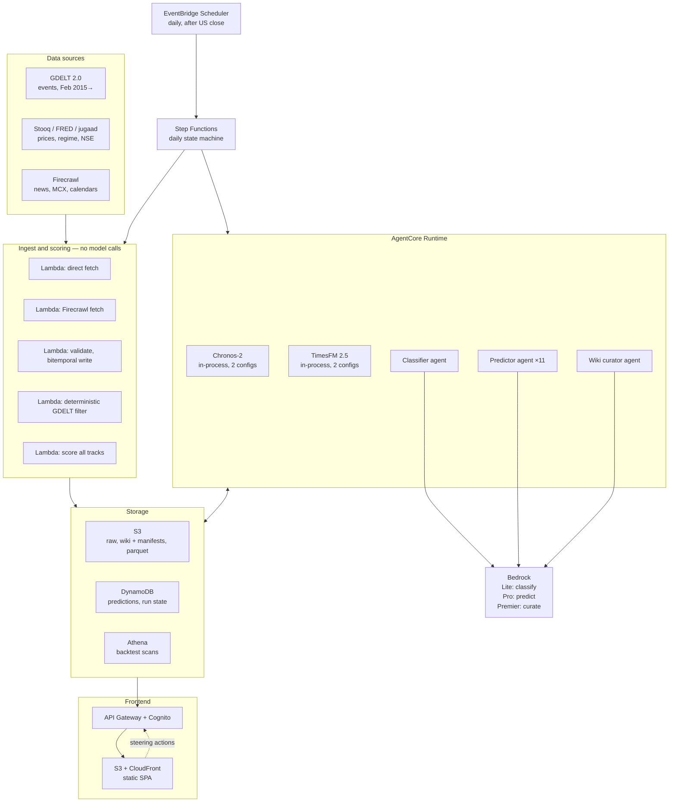

# AWS Architecture and Cost Model

**Status:** Design — authoritative
**Last revised:** 2026-08-09
**Serves:** ADR-0004 (orchestration), ADR-0015 (SAM), ADR-0019 (Bedrock), ADR-0020 (frontend), ADR-0024 (environments), ADR-0027 (model config), ADR-0028 (AgentCore), ADR-0030/0031/0032 (forecasting tracks), **ADR-0037/0038/0039 (forward-only)**

> **Revision 2026-08-09 — forward-only.** [ADR-0037](../adr/0037-forward-only-agent-learning.md) removed historical agent replay. **One-off backfill drops from ~$38 to ~$4.40.** Monthly recurring is unchanged. The architecture below is otherwise the same — forward-only removes a one-time batch job, not a component.

## Architecture

**The dividing line stays ADR-0004's:** ingest, validation, filtering, and scoring are plain Python with no model call. Only classification, prediction, and wiki curation invoke a model. **Chronos and TimesFM sit on the deterministic side** — they are numeric libraries called by pipeline code, not agents (ADR-0030).

## Components

| Layer | Service | Role |
|---|---|---|
| Schedule | EventBridge Scheduler | Fires the daily run after the US close; trading-day aware |
| Orchestration | Step Functions (Standard) | Per-step retry, visibility, bounded spend |
| Deterministic compute | Lambda | Ingest, validation, filtering, scoring, metrics |
| Agent compute | **AgentCore Runtime** | Hosts agents and the two numeric models; 8-hour window (ADR-0028) |
| Models | **Bedrock** | Nova Lite (classify), Nova Pro (predict), Nova Premier (curate) — all three configurable per role (ADR-0027, ADR-0040) |
| Numeric forecasters | Chronos-2, TimesFM 2.5 | In-process from Hugging Face weights; not Bedrock, not agents |
| Object store | S3 | `raw/`, `wiki/` + run manifests (versioned), Parquet price history, cassettes |
| Operational store | DynamoDB | Predictions across all tracks, run state, steering actions |
| Analytics | Athena | Backtest range scans over Parquet |
| Secrets | Secrets Manager | Firecrawl key |
| Frontend | S3 + CloudFront | Static SPA (ADR-0020) |
| Frontend API | API Gateway + Cognito | Reads and steering writes, authenticated (ADR-0023) |
| Observability | CloudWatch + AgentCore Observability | Traces, token usage per stage, latency, errors |
| Events archive | BigQuery (GCP) | GDELT 2.0, free tier |

## Bedrock specifics

**Model IDs carry an `anthropic.` or `amazon.` prefix** — `amazon.nova-premier-v1`, not a bare ID. Use the Mantle client for Anthropic models, not the legacy `bedrock-runtime` InvokeModel path.

**Four capability gaps versus the first-party API:**

| Capability | On Bedrock | Consequence |
|---|---|---|
| Anthropic Batches API | ❌ | Use **Bedrock Batch Inference** — S3 JSONL in, results ≤24h, 50% of on-demand |
| Automatic prompt caching | ❌ | Cache breakpoints placed **manually** via `cache_control` |
| Web search / fetch / code execution | ❌ | No impact — acquisition is Firecrawl and direct fetch |
| Files API, Models API | ❌ | No impact — unused |

**Prompt caching:** write 1.25× input, read 0.1× input, 5-minute TTL by default. **The cacheable-prefix minimum is model-dependent and not monotonic** — 512 tokens on Opus 5, ~4,096 on Haiku 4.5, and **Nova models cap cached content at roughly 20k tokens**. A prefix that caches on one model can silently fail on another, with no error, just `cache_creation_input_tokens: 0`. **Caching economics must be re-derived on every model switch (ADR-0027), never carried across.**

**Caching pays within a run, not across days.** At one run per day the cache is cold at the start. Budget one write per run and keep the agent steps close enough together to stay inside the TTL.

## Cost model — authoritative

Estimates. Token and CPU figures are calculated, not measured. Defaults per ADR-0027; both models are configuration, so these change with the parameter.

| Layer / line | Basis | Monthly |
|---|---|---|
| **Models — Bedrock** | | **$9.55** |
| ├ Nova Pro — predictor, 11 calls/day | ~127k in, 13k out daily — input includes block 6b, the predictor's own track record (ADR-0042) | $4.27 |
| ├ **Nova Premier — wiki curator** (ADR-0040) | ~35k in, 8k out daily — input grown by 1-hop link-neighbour pre-loading (ADR-0041) | **$5.40** |
| ├ Nova Pro — baseline-blind control | sampled days; **must match the predictor model**, or the anchoring index measures the wrong thing | $0.38 |
| ├ Prompt caching credit | ~3k stable blocks × 11 predictor calls | −$0.55 |
| └ Nova Lite — classifier + severity | ~15k in, 3.4k out daily | $0.05 |
| *Temporary — shadow A/B window only (ADR-0039)* | *Nova Premier shadowing the **predictor**, 4 instruments, 60 days* | *+$9.00 for 2 months* |
| **Operations** | | **$3.45** |
| ├ CloudWatch | logs, metrics, AgentCore dashboards | $2.50 |
| ├ Secrets Manager | 2 secrets × $0.40 | $0.80 |
| └ ECR | container images ~1.5GB inc. model weights | $0.15 |
| **Storage** | | **$2.42** |
| ├ DynamoDB | on-demand, predictions + run state | $1.50 |
| ├ Athena | small scans, spiky during backtest | $0.50 |
| └ S3 | ~5GB inc. versioning, cassettes, parquet | $0.42 |
| **Frontend** | | **$0.53** |
| ├ CloudFront | static SPA, single user | $0.50 |
| ├ API Gateway | HTTP API, ~30k requests/month | $0.03 |
| └ Cognito | free tier covers 50k MAU | $0.00 |
| **Ingest** | | **$0.50–16.50** |
| ├ Lambda | ~200 short invocations/day, incl. the nightly correlation sweep (ADR-0041) | $0.52 |
| ├ Firecrawl | free tier, or Hobby | $0.00–16.00 |
| ├ BigQuery — GDELT | free tier, 1TB/month | $0.00 |
| └ Stooq, FRED, jugaad-data | keyless public sources | $0.00 |
| **Agent runtime** | | **$0.50** |
| ├ AgentCore Runtime | ~60s active CPU, ~600s × 4GB session | $0.30 |
| └ Chronos + TimesFM | 44 forecasts/day, ~30s CPU, in-process | $0.05 |
| **Orchestration** | | **$0.04** |
| └ Step Functions Standard | ~1,500 transitions/month | $0.04 |
| **Monthly total** | | **~$16–33** |

**AgentCore Runtime rates:** $0.0895 per vCPU-hour, $0.00945 per GB-hour, per-second billing, **CPU charged on active use only** — I/O wait is free, which suits a pipeline that spends most of its time waiting on Bedrock.

### What the breakdown exposes

- **Bedrock is ~51% of the bill** at the low end, ~25% if Firecrawl reaches the paid tier.
- **The single largest line is now the wiki curator at $4.25** — one call a day, on the more expensive model. That inversion is deliberate and is the whole content of [ADR-0040](../adr/0040-split-reasoning-model-by-role.md): under forward-only a bad prediction is scored and forgotten, while a bad wiki page compounds with no replay machinery left to repair it. The money follows the irrecoverable failure, not the call volume.
- **The predictor's eleven separate calls cost $3.77.** That is the direct price of ADR-0029's per-instrument decision — eleven calls duplicate the shared prompt blocks — and it buys clean attribution and independent retryability.
- **CloudWatch at $2.50 is third largest** — observability costs about a third of all model inference. Appropriate for a system whose point is measurement, but worth knowing.
- **Everything else rounds to noise.** Step Functions is four cents. Cognito is free. The two time-series foundation models together cost five cents, because they run in-process; endpoints would have been ~$75/month each.

### One-off backfill: ~$4.40

Under [ADR-0037](../adr/0037-forward-only-agent-learning.md) the agent is never replayed against a historical date. What remains of backfill is Lane A calibration and the deterministic wiki seed — no agent model calls at all.

| Line | Basis | Cost |
|---|---|---|
| Nova Lite classification, ~5,000 post-filter events, batched | Feeds the seed *and* the severity bar | $0.21 |
| Chronos + TimesFM, ~121,000 forecasts across 2,750 dates | Lane A calibration only, never quoted as skill | $1.00 |
| AgentCore Runtime, ~4 vCPU-hours | Hosts the above | $0.66 |
| Wiki seed — deterministic event→outcome join (ADR-0038) | SQL. No model call. | **$0.00** |
| Prompt regression set, ~20 dates × 4 instruments, Nova Pro | Contract breakage only, not skill measurement | ~$2.00 |
| Climatology and conditional climatology fits | Arithmetic | $0.00 |
| **Total** | | **~$3.87** |
| *Plus, when the shadow window runs* | Nova Premier shadow, 60 days × 4 instruments (ADR-0039) | *+$18.00* |

**What was removed:** the withdrawn ADR-0036 replay ($24) and the offline model A/B ($12). The A/B is not cancelled — [ADR-0039](../adr/0039-live-shadow-model-ab.md) moves it live as a shadow arm at ~$18 over 60 days, ~$9/month for two months and then off. That is ~$6 more than the offline version for materially better evidence, since it measures the models on the live task rather than on reconstructed dates.

**Backfill now costs time rather than money** — one to two hours of wall-clock inside AgentCore's 8-hour window, and nothing on the critical path is sequential.

**For scale, the alternatives that were rejected:** a full 2,750-date replay across 11 instruments on Nova Premier was ~$1,584; the post-cutoff-only window ~$173; event-stratified sampling ~$24. All three bought a contaminated number that would have needed caveating in two directions. Forward-only buys a clean one for nothing, at the price of waiting for it.

**The residual risk is quality, not cost, and it has grown slightly in importance.** A misclassification now propagates into the *seed* — eleven years of correlation-page observations built by a join over Nova Lite's labels. Correcting it means re-running classification and rebuilding the seed, which is cheap ($0.21) but invalidates any live evidence accumulated against the old pages. ADR-0022's spot-check against a stronger model on the labelled sample is required *before* the seed is built, not after.

### Why not SageMaker endpoints

A small always-on real-time endpoint runs roughly $70–90/month standing, whether or not called — several times the entire system, to serve 44 forecasts a day. Serverless Inference avoids the standing charge but adds a service and a network hop for something that runs in-process in milliseconds. Batch Transform remains a reasonable fallback for backfill alone.

### Cost levers, ranked

1. **Forward-only agent learning** (ADR-0037). Removed ~$1,580 at the design's original scope, ~$24 at its cheapest. The only lever that also *improves* correctness rather than trading against it.
2. **Keep models out of deterministic work** (ADR-0004). Structural, not a tuning knob.
3. **Seed by deterministic join rather than by replay** (ADR-0038). Buys the wiki's observation base for $0.
4. **Deterministic pre-filtering before classification** (ADR-0021). Free, and it cut classification tenfold.
5. **In-process numeric models rather than endpoints.** ~$75/month avoided per model.
6. **Model tiering** (ADR-0027). Reasoning model choice moves the largest line by 5×.
7. **Batch Inference for anything not latency-sensitive.** Halves those lines.
8. **Manual cache breakpoints.** Worth ~$1.75/month now, growing with the wiki.

Levers 1 and 3 are worth separating from the rest: every other entry trades something away — fidelity, latency, model capability. Those two removed cost by removing an operation that was also the project's largest correctness liability.

### Estimation confidence

Per-forecast latency and per-call token counts are calculated, not measured. Figures could be off by several times. **The conclusions are robust to that** — even at 5× the estimate, the system is under $150/month and backfill under $10. What would change materially is only the Bedrock line, which is why ADR-0028's AgentCore Observability adoption matters: token usage per stage is the metric that turns these estimates into measurements.

## Deployment

**The stack is entirely serverless, so SAM covers all of it** — Lambdas, Step Functions (definition externalised to `.asl.json`), S3, CloudFront, API Gateway, Cognito, DynamoDB, EventBridge, IAM. ADR-0015's deployment boundary split closed when ADR-0020 replaced the container with a static SPA.

**Environments:** three stacks in a single account in **us-east-1** (ADR-0024) — `finevents-dev`, `finevents-uat`, `finevents-prod`. IAM is the only boundary between Dev and the production learning history, so environment-prefixed resource names, prefix-scoped IAM with **explicit denies** on production resources, and versioning plus deletion protection on the production wiki are mandatory rather than advisory.

## Verification needed before build

- [ ] Confirm **Nova Premier pricing** — sources report both $2.00/$8.00 and $2.50/$12.50 per 1M; figures above use the higher pair. **Now affects the recurring bill, not just a one-off** (ADR-0040 puts Premier on the daily curator), so this moved from nice-to-know to load-bearing.
- [ ] Confirm **Nova Lite, Nova Pro and Nova Premier availability** in us-east-1, and request model access for all three (not enabled by default). ADR-0040 means a missing Premier grant breaks the daily run, not just the shadow window.
- [ ] Confirm **AgentCore availability and SAM coverage** in us-east-1 — if SAM cannot express AgentCore resources, the single-command deploy fragments again.
- [ ] Confirm whether **Bedrock Batch Inference supports prompt caching** — if not, batching and caching are mutually exclusive per stage.
- [ ] Confirm **Chronos-2's maximum context length**, which fixes the rolling-window size N.
- [ ] Confirm **TimesFM 2.5's licence** before it enters a public repo's build.
- [ ] Verify **deterministic seeding** for both numeric models — without it, Lane A truncated replay breaks.
- [ ] Measure **actual post-filter event volume** — the ~5,000 figure drives the classification estimate and the seed's density.
- [ ] Establish **pre-training cutoffs** for Chronos and TimesFM. **Downgraded by ADR-0037** — no longer needed to caveat agent results, since live targets are contamination-free. Still needed to label Lane A calibration and to interpret any live Lane A underperformance.
- [ ] Confirm **market calendars and DST handling** for NSE and NYSE in UTC — the input to the L9 cross-market ordering test, which ADR-0037 promotes to the top leakage risk.

## Open decisions

- Labelled-sample size and recall floor for the pre-filter (ADR-0021)
- Spot-check disagreement threshold for classification quality (ADR-0022) — now gates the seed as well as live classification
- Sampling rate for baseline-blind control runs (ADR-0029)
- Length of the post-go-live tuning period whose results are excluded from the skill record (ADR-0037) — must be fixed before go-live, not after seeing results
- Licence: permissive required for harness reuse (ADR-0033); data-redistribution policy separate
